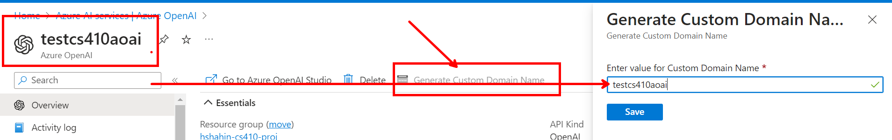
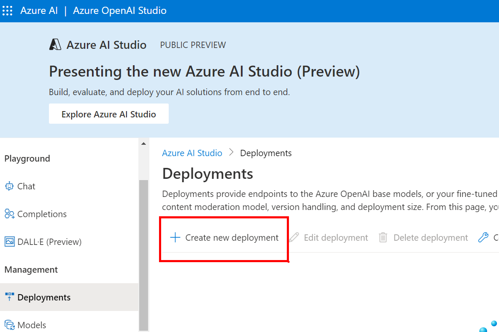
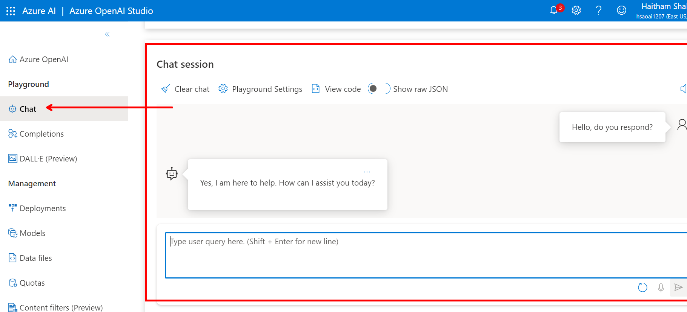

# Documentation for Installation and Deployment

The guide below walks through the deployment of this Tech Chat Assistant in Azure. Please follow all steps below in order.

## Pre-Requisites:

Before starting, please ensure you have all the following:

### CLI Tools

1) [Azure CLI](https://learn.microsoft.com/en-us/cli/azure/install-azure-cli)

2) [Docker Engine](https://docs.docker.com/engine/install/)

3) Python3 and pip3 for your system: 

    > You can check if you have this by running the following:

    ```bash
    python3 --version
    pip3 -V
    ```

### Azure Pre-Reqs:

> Please be aware that the resources deployed here incur costs to run in Azure. Be sure to delete these in Azure immediately once complete so that you can not incur more than necessary.

> Currently Azure OpenAI is only available to enterprise customers and partners. Therefore, you may be unable to deploy this solution until that changes.

1) Azure Subscription with Free Trial and Credit. You will need to go through the [sign-up process at this link](https://azure.microsoft.com/en-us/free/search/?ef_id=_k_CjwKCAiA98WrBhAYEiwA2WvhOl20s3GTMN0rakWqE2QvxiC4NfizC7ZO9Y2f7FZ4mDSBuEHpzPCVARoCsPAQAvD_BwE_k_&OCID=AIDcmmfq865whp_SEM__k_CjwKCAiA98WrBhAYEiwA2WvhOl20s3GTMN0rakWqE2QvxiC4NfizC7ZO9Y2f7FZ4mDSBuEHpzPCVARoCsPAQAvD_BwE_k_&gad_source=1&gclid=CjwKCAiA98WrBhAYEiwA2WvhOl20s3GTMN0rakWqE2QvxiC4NfizC7ZO9Y2f7FZ4mDSBuEHpzPCVARoCsPAQAvD_BwE)

2) Azure Open AI - [Enable Your Subscription for OpenAI](https://azure.microsoft.com/en-us/products/ai-services/openai-service). Currently this is ONLY available for enterprise customers as partners as [noted here](https://learn.microsoft.com/en-us/legal/cognitive-services/openai/limited-access). However, should this limitation be lifted in the future you can apply for access.

# Deployment Steps

## Shell Setup

1. Create a copy of the `.env.example` file to get started and name the copy `.env`

```bash
cp .env.example .env
```

2. Fill in the `.env` files with your specific values

3. Run from the shell the following to set your `.env` variables. Be sure to do this on each restart of your shell:

```bash
set -a
source .env
set +a
```

4. Run `az login --use-device-code` to login from the terminal

## Main Deploy of Infrastructure

> Be sure that all steps above have been run first

1. Run `./infra/main-deploy.sh`

## Deploying the OpenAI Models

1. Search for OpenAI in the Azure Portal:


2. Generate a custom domain name for your deployment by selecting on the Generate Custom Domain button. Make the name the same as your resource name:



3. Click on your OpenAI instance and then select on Model Deployments and Manage Deployments:


4. Once in the OpenAI Studio, you can select on Deployments and Create New Deployment:



5. Deploy the embedding model as shown below. Be sure that the name matches the model deployment. Nothing under Advanced Options needs to be modified:


6. Once that is complete, create another model deployment for the GPT model as shown below. Be sure the names match and nothing under Advanced Options needs to be modified:


7. As a final check to confirm all is working, you can actually chat with your GPT Model as shown below in the studio:



## Setting up the Search Index

1. Navigate to the Azure Portal (portal.azure.com) and in the blue search for AI Search:


2. Select on your AI Search Instance and then Click on `Import and Vectorize Data`:


3. Select your Storage Account for the Data Import and also select to use the System Assigned Managed Identity:


4. Next, select your OpenAI Embedding Model:


5. Next, select your cognitive services resource for image to text enrichment:


6. Keep moving and select to enable the Semantic Ranker:


7. On the last step, you may change the prefix for the indexer and select create:


8. To confirm all worked, you should see the following on your Search Resource when you select on the indexer that was created:


## Test Search

1. You can navigate to the Search Explorer to Test your Index:


2. From there, you can test queries. Make sure that the proper index is selected:


## Run Application Locally

1. Navigate to the `./app` folder and create a `.env` file in the app folder based on the `.env.example` file:

```bash
cd app
cp .env.example .env
```

2. Fill in the values for the `.env` file. The values are below with associated guidance on where to find the values:

    a) AZURE_SEARCH_SERVICE - Select on your search service and copy the name:
        

    b) AZURE_SEARCH_INDEX - Select on your search index and copy the name:
        

    c) AZURE_SEARCH_KEY - Select on the Keys blade and copy the primary key:
        

    d) AZURE_SEARCH_SEMANTIC_SEARCH_CONFIG - First select on your index. Then, select on Semantic Configuration and copy the name:
        
        

    f) AZURE_OPENAI_RESOURCE - Select on your OpenAI Resource and copy the name:
        

    g) AZURE_OPENAI_KEY
        

3. From within the `app` folder, run a docker build as shown below:

```bash
cd app
docker build . -t tech-chat-app
```

4. Once the build is complete, you can run the app from your local machine (make sure you are in the `app`` folder):

```bash
docker run -p 80:80 --env-file .env tech-chat-app
```

5. In your browswer, navigate to `http://localhost` and you should now be able to chat with the app locally:


## Deploy Web App to Azure

1. Run the following set of commands to update the app settings on Azure:

```bash
# run from root of repo and set .env to ensure variables set
set -a
source .env
set +a

# run from app folder
cd ./app

# install python module to convert .env to proper json format
python3 -m pip install "python-dotenv"
python3 convert-env.py -i .env

# upload .env.json file to azure app settings
az webapp config appsettings set --resource-group $RG_NAME --name $WEB_APP_NAME --settings @.env.json
```

2. Get the deployed app url by running the following:

```bash
az webapp show -n $WEB_APP_NAME -g $RG_NAME --query "defaultHostName" -o tsv
```

3. Navigate to your link and interact with your tech chat app!


## Cleanup

Once you are ready to delete the application and associated resources from Azure, run the following command:

```bash
az group delete -n $RG_NAME -y
```