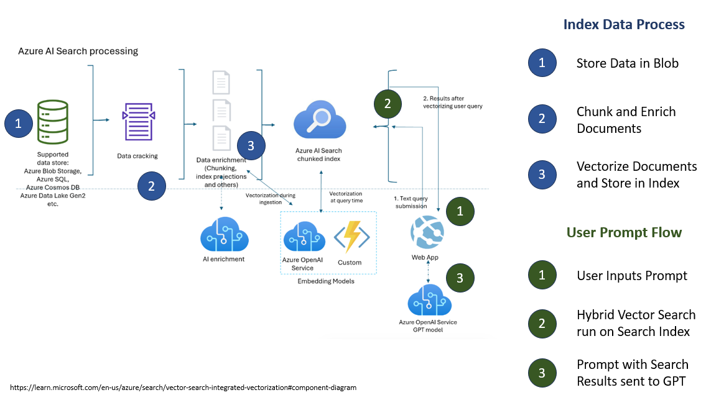

# CS410 Project

Author/Captain: Haitham Shahin - hshahin2@illinois.edu

Theme: Intelligent Learning Platform

Topic: Technical IT Learning Assistant

Name: Tech Chat Assistant

# Software Usage Tutorial Presentation

Be sure to watch the following in 1080:

[High Level Software Usage Tutorial Overview](https://www.youtube.com/watch?v=vQQ_wVLecmc) - https://www.youtube.com/watch?v=vQQ_wVLecmc

[Deep Dive Software Usage, Installation, and Deployment Overview](https://www.youtube.com/watch?v=BuHg84Tldag) - https://www.youtube.com/watch?v=BuHg84Tldag

# Overview of Function of Code

This repository is designed to deploy a GPT-Enabled Tech Chat Assistant in Azure that can answer questions based on internal technical documentation unique to a specific enterprise. 

The app works by [grounding](https://techcommunity.microsoft.com/t5/fasttrack-for-azure/grounding-llms/ba-p/3843857) the GPT model with technical documentation that is provided to represent an enterprise's specific cloud requirements. For example, enterprises commonly require internal, private networking when deploying services in the cloud - however, if an employee looks to learn by following documentation online, they may miss this requirement and deploy a service insecurely. Thus, the Tech Chat app provides employees with an internal tool they can use for technical questions, knowing that it will take into account specific enterprise requirements into it's responses. This is implemented through the RAG pattern, which means user questions are first queried against an internal knowledge base (using Azure AI Search in this implementation), and then the retrieved information is augmented to the user's initial prompt before being sent along to the GPT model.

The high-level architecture for the implementation is shown below with associated annotations for steps:

# Documentation of Software Implementation

Below are all the components needed to run this app and associated implementation details. Refer below to the [Deploy README](./DEPLOY.MD) to actually see the documentation for installation.

1. [Storage Account](https://learn.microsoft.com/en-us/azure/storage/common/storage-account-overview)

    The architecture requires a blob storage account in Azure that will host the technical documentation. Under the `infra/sample-data` folder are sample documents (PDF, Markdown) that will be uploaded to the storage account for demonstration. You can include custom technical documentation in the folder to test your own files.

2. [Azure AI Search](https://learn.microsoft.com/en-us/azure/search/search-what-is-azure-search)

    The Azure AI Search service implements our search index. Additionally, the system leverages the [integrated vectorization](https://learn.microsoft.com/en-us/azure/search/vector-search-integrated-vectorization) capability to chunk, vectorize, enrich, and index all the data from the storage account.

3. [Azure Cognitive Services / AI Services Multi Account](https://learn.microsoft.com/en-us/azure/ai-services/what-are-ai-services)

    This resource in Azure provides the indexer used in AI Search with the ability to extract text from images embedded in documentation that is being analyzed. By using Optical Character Recognition and other AI Services from Azure, the Search Index can enrich the documents before indexing them.

4. [Azure OpenAI](https://learn.microsoft.com/en-us/azure/ai-services/openai/overview)

    The Azure OpenAI Service provides us with a GPT Model and Embedding model. Specifically, this application requires the `text-embedding-ada-002` embedding model and one of the GPT model (this demo deploys the `gpt-35-turbo-16k` GPT model).

    Another capability leveraged in this app is the [OpenAI On Your Data Feature](https://learn.microsoft.com/en-us/azure/ai-services/openai/concepts/use-your-data?tabs=ai-search) which natively hooks into the API calls a query to the associated Search Index that was previously created. By using this feature, only one API call is required to fully implement the RAG architecture (behind the scenes, the flow as shown above in the architecture is taken).

5. [Azure Container Registry](https://learn.microsoft.com/en-us/azure/container-registry/container-registry-intro)

    This resource is used solely to build the Container Image that will host the Web App that runs the Tech Chat Assistant app. Think of this being your docker registry in the cloud that can also run `docker build` commands.

6. [Azure App Service](https://learn.microsoft.com/en-us/azure/app-service/)

    This service in Azure is a PaaS platform that will host the Web App Container. The app will have a public endpoint that end users can query.

7. [Tech Chat App and Dockerfile](./app/)

    This refers to the `./app` folder that houses the web app code - both the frontend which is in the `./app/frontend` folder and the python backend which is in the `./app/backend` folder. The code was sourced from the following [sample-app-aoai-chatGPT repo](https://github.com/microsoft/sample-app-aoai-chatGPT/tree/main). Very minor modifications were made, so one can reuse the upstream sample repo if needed for future extensions.

    Additionally, the `Dockerfile` in this folder builds both the frontend and backend into one image that can be deployed to any service that can run Docker containers.

    Full documentation of the application can be found at the upstream repo here: [sample-app-aoai-chatGPT](https://github.com/microsoft/sample-app-aoai-chatGPT/tree/main)

# [Documentation of Installation and Deployment](./DEPLOY.MD)

> Currently, the [Azure OpenAI](https://learn.microsoft.com/en-us/azure/ai-services/openai/overview) is [not available to personal accounts for use](https://learn.microsoft.com/en-us/legal/cognitive-services/openai/limited-access). Thus, you may not be able to deploy the system on your own currently until this limitation is lifted. For now, you can review the video of the full deployment to see it live and understand how the system works.

Please follow the full [Deploy Guide](./DEPLOY.MD) to view all the requirements for installation and deployment if you have access to an enterprise subscription.

Here is also a video walking through the full deployment:

Take note that this solution uses Microsoft Azure Cloud and will incur fees, so please remove the solution once complete so you can save on costs. If new to Azure, your subscription should start with $200 free credit as noted [here](https://azure.microsoft.com/en-us/free/search/?ef_id=_k_EAIaIQobChMImf2vuJeGgwMVyUdyCh3TkgzLEAAYASAAEgJzZfD_BwE_k_&OCID=AIDcmmfq865whp_SEM__k_EAIaIQobChMImf2vuJeGgwMVyUdyCh3TkgzLEAAYASAAEgJzZfD_BwE_k_&gad_source=1&gclid=EAIaIQobChMImf2vuJeGgwMVyUdyCh3TkgzLEAAYASAAEgJzZfD_BwE#all-free-services).

# Assignments
- [Project Proposal](./project-proposal.pdf)
- [Progress Report](./progress-report.pdf)

# Credit to Open Source

- The app code and Dockerfile used here was sourced from the [sample-app-aoai-chatGPT repo](https://github.com/microsoft/sample-app-aoai-chatGPT/tree/main).

- The script `./app/convert-env.py` was sourced from the following [gist](https://gist.github.com/zboldyga/8f51868c7b1d7269bb2679fb036d4995).